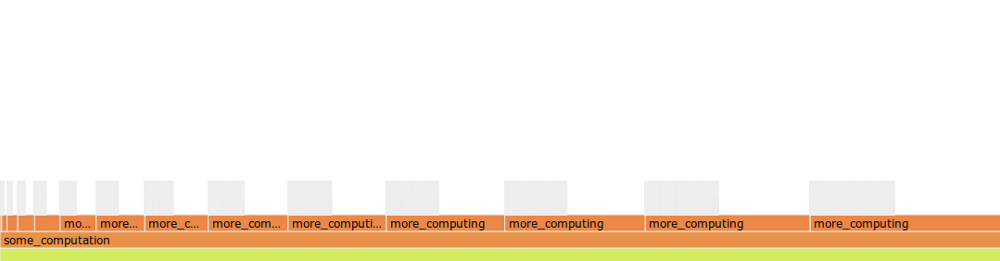

A proc macro to insert appropriate `flame::start_guard(_)` calls (for use with
[flame](https://github.com/TyOverby/flame))

[](https://travis-ci.org/llogiq/flamer)
[](https://crates.io/crates/flamer)
[](https://docs.rs/flamer)


**This proc macro requires Rust 1.30.**
Because flamer is a proc macro attribute, it uses APIs stabilized in Rust 1.30.

## Usage:

In your Cargo.toml add `flame` and `flamer` to your dependencies:

```toml
[dependencies]
flame = "0.2.2"
flamer = "0.5"
```

Then in your crate root, add the following:

```rust
extern crate flame;
#[macro_use] extern crate flamer;

#[flame]
// The item to apply `flame` to goes here.
```

Unfortunately, currently stable Rust doesn't allow custom attributes on modules.
To use `#[flame]` on modules you need a nightly Rust with
`#![feature(proc_macro_hygiene)]` in the crate root
([related issue](https://github.com/rust-lang/rust/issues/54727)):

```rust
#![feature(proc_macro_hygiene)]

extern crate flame;
#[macro_use] extern crate flamer;

#[flame]
mod flamed_module { .. }
```

You may also opt for an *optional dependency*. In that case your Cargo.toml should have:

```toml
[dependencies]
flame = { version = "0.2.2", optional = true }
flamer = { version = "0.3", optional = true }

[features]
default = []
flame_it = ["flame", "flamer"]
```

And your crate root should contain:

```rust
#[cfg(feature = "flame_it")]
extern crate flame;
#[cfg(feature = "flame_it")]
#[macro_use] extern crate flamer;

// as well as the following instead of `#[flame]`
#[cfg_attr(feature = "flame_it", flame)]
// The item to apply `flame` to goes here.
```

For nightly module support, also add
`#![cfg_attr(feature = "flame_it", feature(proc_macro_hygiene))]` in the crate
root:

```rust
#![cfg_attr(feature = "flame_it", feature(proc_macro_hygiene))]

#[cfg(feature = "flame_it")]
extern crate flame;
#[cfg(feature = "flame_it")]
#[macro_use] extern crate flamer;

// as well as the following instead of `#[flame]`
#[cfg_attr(feature = "flame_it", flame)]
mod flamed_module { .. }
```

You should then be able to annotate every item (alas, currently not the whole
crate; see the
[custom inner attribute](https://github.com/rust-lang/rust/issues/54726) issue
for more details) with `#[flame]` annotations.
You can also use `#[noflame]` annotations to disable instrumentations for
subitems of `#[flame]`d items. Note that this only instruments the annotated
methods, it does not print out the results.

The `flame` annotation can also take an optional parameter specifying a string
to prefix to enclosed method names.
This is especially useful when annotating multiple methods with the same name,
but in different modules.

```rust
#[flame("prefix")]
fn method_name() {
    //The corresponding block on the flamegraph will be named "prefix::method_name"
}
```

## Full Example
```rust
use std::fs::File;

use flame as f;
use flamer::flame;

#[flame]
fn make_vec(size: usize) -> Vec<u32> {
    // using the original lib is still possible
    let mut res = f::span_of("vec init", || vec![0_u32; size]);
    for x in 0..size {
        res[x] = ((x + 10)/3) as u32;
    }
    let mut waste_time = 0;
    for i in 0..size*10 {
        waste_time += i
    }
    res
}
#[flame]
fn more_computing(i: usize) {
    for x in 0..(i * 100) {
        let mut v = make_vec(x);
        let x = Vec::from(&v[..]);
        for i in 0..v.len() {
            let flip = (v.len() - 1) - i as usize;
            v[i] = x[flip];
        }
    }
}
#[flame]
fn some_computation() {
    for i in 0..15 {
        more_computing(i);
    }
}

#[flame]
fn main() {
    some_computation();
    // in order to create the flamegraph you must call one of the
    // flame::dump_* functions.
    f::dump_html(File::create("flamegraph.html").unwrap()).unwrap();
}
```


Refer to [flame's documentation](https://docs.rs/flame) to see how output works.

License: Apache 2.0
